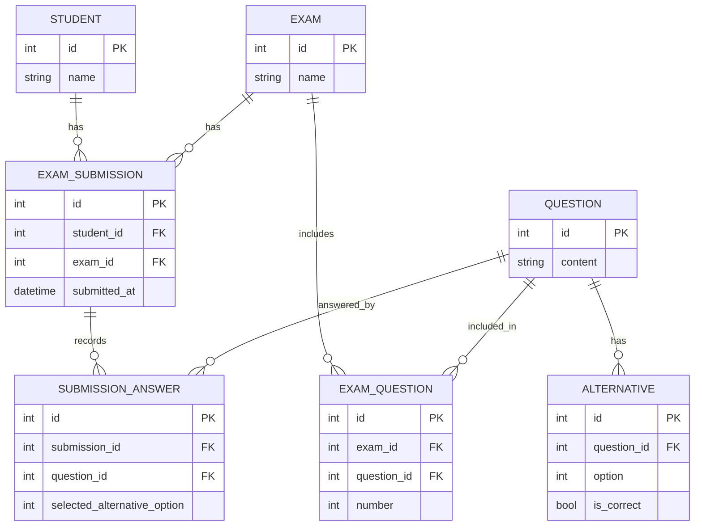

# API de Exames – Documentação

Este documento descreve a estrutura da API, a arquitetura do sistema e os formatos de dados aceitos e retornados pelos principais endpoints.

## 1. Arquitetura e Componentes

- Serviço HTTP (Django + DRF): expõe os endpoints da API.
- Processamento assíncrono (Celery workers): executa a criação de submissões fora do ciclo de requisição HTTP.
- Broker e Result Backend (Redis): fila as tarefas e armazena o status/resultado para consulta.
- Banco de Dados (SQLite em desenvolvimento e testes; PostgreSQL em produção via Docker Compose).

Fluxo simplificado de submissão:
1) Cliente envia POST para o endpoint de submissão assíncrona.
2) A API valida os dados e enfileira uma tarefa Celery, retornando 202 Accepted e um identificador de tarefa (task_id).
3) O worker Celery consome a tarefa e cria a submissão e as respostas no banco de dados.
4) O cliente consulta o status pelo task_id e, quando a tarefa estiver concluída, recebe o resultado com os dados da submissão.

## 2. Modelos de Dados e Relacionamentos

Esta seção descreve as entidades principais, seus campos relevantes e como elas se relacionam entre si, utilizando cardinalidades (one-to-many, many-to-many, etc.).

### 2.1. Entidades

#### Student (AUTH_USER_MODEL)
- id: inteiro
- username, email, name

#### Question
- id: inteiro
- content: texto da questão

#### Alternative
- id: inteiro
- question_id: inteiro (FK para Question)
- option: inteiro [1..5] (A..E)
- is_correct: booleano

Relação: Question (one) → Alternative (many) [one-to-many]

#### Exam
- id: inteiro
- name: string
- questions: ManyToMany para Question via tabela de junção ExamQuestion

Relação: Exam (many) ↔ Question (many) [many-to-many] por meio de ExamQuestion

#### ExamQuestion (tabela de junção/atributiva)
- id: inteiro
- exam_id: inteiro (FK para Exam)
- question_id: inteiro (FK para Question)
- number: inteiro (ordem da questão no exame)

Restrição: unique_together (exam, number)

#### ExamSubmission
- id: inteiro
- student_id: inteiro (FK para Student)
- exam_id: inteiro (FK para Exam)
- submitted_at: datetime
- score: propriedade calculada (percentual de acerto)
- correct_answers_count: propriedade calculada

Restrições: unique_together (student, exam)

Relações:
- Student (one) → ExamSubmission (many) [one-to-many]
- Exam (one) → ExamSubmission (many) [one-to-many]

#### SubmissionAnswer
- id: inteiro
- submission_id: inteiro (FK para ExamSubmission)
- question_id: inteiro (FK para Question)
- selected_alternative_option: inteiro [1..5] (A..E)

Restrição: unique_together (submission, question)

Relações:
- ExamSubmission (one) → SubmissionAnswer (many) [one-to-many]
- Question (one) → SubmissionAnswer (many) [one-to-many]

### 2.2. Visão Geral dos Relacionamentos

- Question 1 — N Alternative
- Exam N — N Question (via ExamQuestion)
- Exam 1 — N ExamQuestion; Question 1 — N ExamQuestion
- Student 1 — N ExamSubmission
- Exam 1 — N ExamSubmission
- ExamSubmission 1 — N SubmissionAnswer
- Question 1 — N SubmissionAnswer

Observação: não há relacionamentos one-to-one entre os modelos do domínio de exame/submissão.

### 2.3. Diagrama de Relacionamentos (ER)



## 3. Endpoints

Base: `/api/exam/`

### 3.1. Submissões

1) Criar submissão (assíncrono)
- Método: POST
- URL: `/api/exam/submissions/`
- Corpo (JSON):
```json
{
    "student_id": 1,
    "exam_id": 10,
    "answers": [
        {"question_id": 101, "selected_option": 2},
        {"question_id": 102, "selected_option": 4}
    ]
}
```
- Respostas:
    - 202 Accepted
    ```json
    {
        "success": true,
        "message": "Submissão recebida e enfileirada",
        "processing": "asynchronous",
        "task_id": "<uuid>",
        "poll_url_hint": "/api/exam/submissions/status/?task_id=<uuid>"
    }
    ```
    - 400 Bad Request (erros de validação)
    ```json
    {
        "success": false,
        "errors": {
            "student_id": ["Estudante não existe"],
            "answers": ["Questões [X] não pertencem ao exame Y"]
        }
    }
    ```

2) Consultar status de submissão
- Método: GET
- URL: `/api/exam/submissions/status/?task_id=<uuid>`
- Respostas:
    - 202 Accepted (PENDING/STARTED)
    ```json
    {"success": true, "task": {"state": "PENDING"}}
    ```
    - 200 OK (SUCCESS)
    ```json
    {
        "success": true,
        "task": {
            "state": "SUCCESS",
            "created": true,
            "submission": {"id": 1, "student_id": 1, "exam_id": 10, "score": 100.0, "total_answers": 2}
        }
    }
    ```
    - 500 (FAILURE)
    ```json
    {"success": true, "task": {"state": "FAILURE", "error": "<mensagem>"}}
    ```

3) Listar submissões
- Método: GET
- URL: `/api/exam/submissions/`
- Parâmetros de query suportados: `student`, `student_id`, `exam`, `exam_id`, `student_name`.
- Resposta (200):
```json
{
    "success": true,
    "count": 1,
    "results": [
        {
            "id": 1,
            "student_name": "João Silva",
            "exam_name": "Exame X",
            "submitted_at": "2025-11-13T14:53:21Z",
            "total_questions": 2,
            "correct_answers": 2,
            "score_percentage": 100.0,
            "questions": [ /* ver seção 3.3 */ ]
        }
    ]
}
```

4) Detalhar submissão
- Método: GET
- URL: `/api/exam/submissions/{id}/`
- Resposta (200):
```json
{
    "success": true,
    "results": {
        "id": 1,
        "student_name": "João Silva",
        "exam_name": "Exame X",
        "submitted_at": "2025-11-13T14:53:21Z",
        "total_questions": 2,
        "correct_answers": 1,
        "score_percentage": 50.0,
        "questions": [ /* ver seção 3.3 */ ]
    }
}
```

5) Submissões por estudante
- Método: GET
- URL: `/api/exam/submissions/student_submission/?student_id=<id>`
- Observação: aceita também `student=<id>` como alias de `student_id`.
- Resposta (200):
```json
{
    "success": true,
    "student_id": "1",
    "total_submissions": 3,
    "average_score": 85.5,
    "submissions": [ /* lista resumida por submissão */ ]
}
```

6) Resultado de um estudante em um exame
- Método: GET
- URL: `/api/exam/submissions/student/{student_id}/exam/{exam_id}/`
- Resposta: mesmo formato de detalhes de submissão.

7) Análise detalhada por submissão
- Método: GET
- URL: `/api/exam/submissions/{id}/detailed_analysis/`
- Resposta (200): inclui média do exame, percentil do aluno e total de submissões.

### 3.2. Exames

1) Listar e criar exames
- Método: GET/POST
- URL: `/api/exam/exams/`

2) Detalhar/atualizar/excluir exame
- Método: GET/PUT/PATCH/DELETE
- URL: `/api/exam/exams/{id}/`

3) Estatísticas do exame
- Método: GET
- URL: `/api/exam/exams/{id}/statistics/`

### 3.3. Estrutura de questão em resultados

Cada item em `questions` possui a seguinte estrutura:
```json
{
    "id": 101,
    "content": "Enunciado da questão",
    "alternatives": [
        {"option": 1, "option_letter": "A", "content": "...", "is_correct": false},
        {"option": 2, "option_letter": "B", "content": "...", "is_correct": true}
    ],
    "student_answer": 2,
    "student_answer_letter": "B",
    "correct_answer": 2,
    "correct_answer_letter": "B",
    "is_correct": true
}
```

## 4. Regras de Validação (resumo)

- `student_id` e `exam_id` devem existir.
- Todas as `answers[*].question_id` devem existir e pertencer ao exame informado.
- Não podem existir questões duplicadas em `answers`.
- `selected_option` deve estar entre 1 e 5.
- Um estudante pode ter apenas uma submissão por exame (restrição de unicidade em banco).

## 5. Observações de Operação

- Em produção, recomenda-se Redis para broker/result backend e PostgreSQL para banco.
- Para alto volume, configure múltiplos workers Celery e aumente `--concurrency`.
- Em testes, o projeto está configurado para executar Celery em modo eager (processamento imediato e sem broker externo).